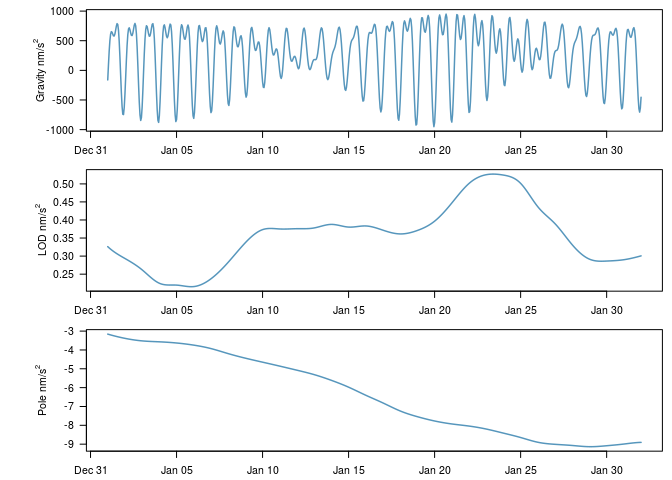

earthtide [](https://travis-ci.org/jkennel/earthtide) [](https://codecov.io/github/jkennel/earthtide?branch=master) [](https://cran.r-project.org/package=earthtide) [](https://cran.r-project.org/package=earthtide) [](https://cran.r-project.org/package=earthtide)
--------------------------------------------------------------------------------------------------------------------------------------------------------------------------------------------------------------------------------------------------------------------------------------------------------------------------------------------------------------------------------------------------------------------------------------------------------------------------------------------------------------------------------------------------------------------------------------------------------------------------------

The **earthtide** package simplifies the generation of earth tides and wave group harmonics for analysis in **R**.

Background
==========

**earthtide** is a port of the 'Fortran ETERNA 3.4' (Wenzel, 1996) predict and part of the analyze codes with the Kudryavtsev 2004 update. The original 'Fortran' code was rewritten in **R**, and **C++** using the great **Rcpp**, **RcppArmadillo**, and **RcppParallel**. The package is useful for generating synthetic earth tides using highly accurate tidal catalogs for prediction and regression. Attempts were made to ensure that results were consistent with the 'ETERNA 3.4', however, there is always the possibility that a bug was introduced in during the conversion and update. For the most feature rich version and up-to-date version of 'ETERNA' please see <http://ggp.bkg.bund.de/eterna/> maintained by Klaus Schueller.

Hartmann, T., Wenzel, H.-G., 1995. The HW95 tidal potential catalogue. Geophys. Res. Lett. 22, 3553–3556. (<https://doi.org/10.1029/95GL03324>)

Kudryavtsev, S.M., 2004. Improved harmonic development of the Earth tide-generating potential. J. Geod. 77, 829–838. (<https://doi.org/10.1007/s00190-003-0361-2>)

Wenzel, H.G. 1996: The nanogal software: Earth tide data processing package ETERNA 3.30. Bull. Inf. Marges Terrestres. 124, 9425-9439. (<http://www.eas.slu.edu/GGP/ETERNA34/MANUAL/ETERNA33.HTM>)

Installation
============

You can install the [CRAN](https://CRAN.R-project.org/package=earthtide) version with the following command:

``` r
install.packages('earthtide')
```

The development version can be installed from github using the following commands:

``` r
library(devtools)
install_github('jkennel/earthtide')
```

Example
=======

The following code computes the synthetic gravity, LOD tide, and pole tide and returns a data.frame of results.

``` r
library(earthtide)

# One month of hourly data
tide <-  Earthtide$
  new(utc = as.POSIXct("2015-01-01", tz = "UTC") + 0:(24*31) * 3600,
      latitude = 52.3868,
      longitude = 9.7144,
      wave_groups = data.frame(start = 0.0, end = 6.0))$
  predict(method = "gravity", astro_update = 1)$    # compute gravity
  lod_tide()$                                       # add LOD tide to results
  pole_tide()$                                      # add pole tide to results
  tide()                                            # get result data.frame
```



License
=======

GPL-3
